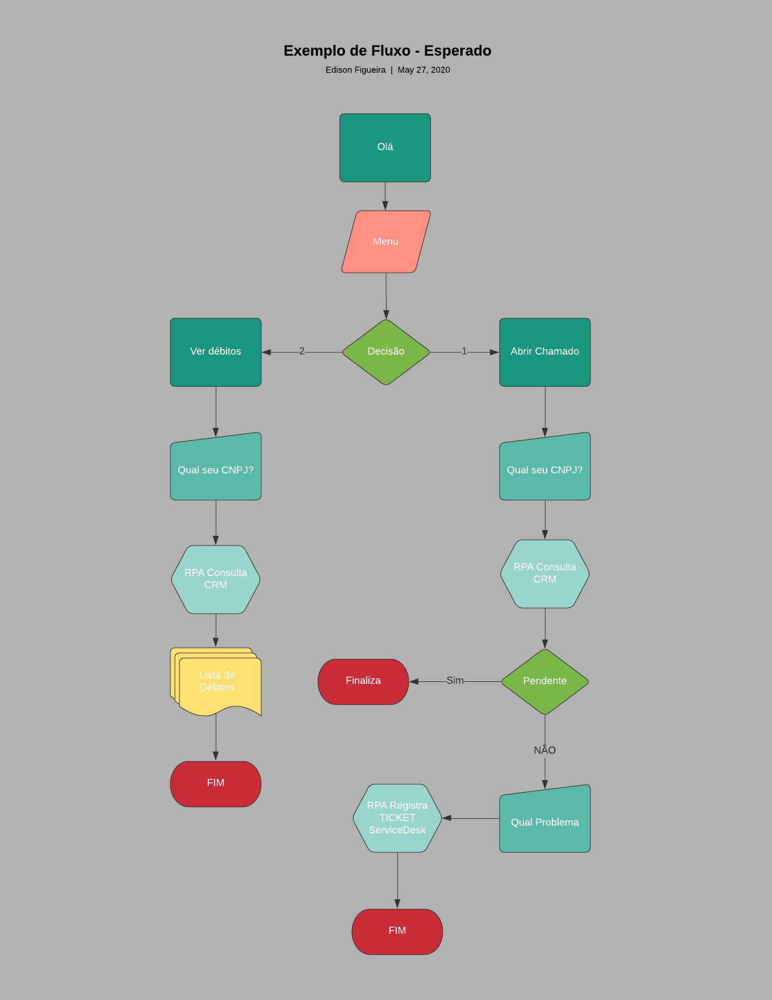
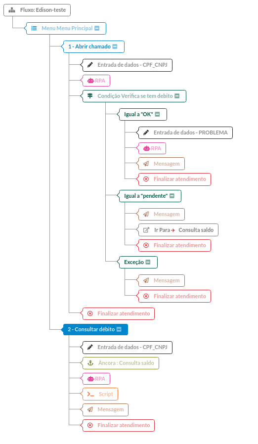

# Low code flow with SZ.chat
This material is to guide people to use the RPA module in SZ.Chat in order to make their own integrations and automate processes in the service flow.

# Pre req

Every integration requires documentation of the APIs to be integrated, without which it is not possible to perform any integration.

# Scenario

Imagine that a customer wants to do the following flow<br>

Customer enters the Chat and wants to open a ticket, but it is only allowed to open the ticket if the customer is up to date with his payments.

* Consult the customer's balance in the ERP via ID.
* If the customer is up to date, he can open the ticket on the ServiceDesk
* If the customer has debts, the system shows the list of debts and denies opening calls.
* Show the sum of debts as well

# Picture



# API documentation

Sample data
* **99.999.999/0001-99** - ID without debts
* **99.999.999/0002-99** - ID with debts
* token **tokendeexemplo**

### ERP

**Endpoint for check balance** https://learn-rpa-dot-edison-research.uc.r.appspot.com/sample/crm/consulta<br>
**Method**

`POST`

**Auth** 

`token on header`

**JSON for sample request**
```json
{
	"cnpj": "99.999.999/0001-99|required"
}
```
**Result with no debts**
```json
{
    "cnpj": "99.999.999/0001-99",
    "Name": "Company sample 1",
    "Address": " 767 5th Ave",
    "City": "New York",
    "Estate": "NY",
    "d": [],
    "status": "OK"
}
```
**Result with debts**
```json
{
    "cnpj": "99.999.999/0002-99",
    "Name": "Company sample 2",
    "Address": " 242 W 41st St",
    "City": "New York",
    "Estate": "NY",
    "d": [
        {
            "year": "2020",
            "mouth": "April",
            "value": 10000
        },
        {
            "year": "2020",
            "mouth": "Janaury",
            "value": 20000
        }
    ],
    "status": "debt"
}
```
### SERVICE DESK

**Endpoint for open ticket** https://learn-rpa-dot-edison-research.uc.r.appspot.com/sample/servicedesk/ticket<br>
**Method** 

`POST`

**Auth** 

`token on header`

**JSON for sample request**
```json
{
    "cnpj": "99.999.999/0001-99|required",
    "Problem": "required"
}
```
**Result**
```json
{
    "date": "14/05/2020",
    "id": 29008,
    "status": "New ticket created",
    "ticketTitle": "Issue subject"
}
```
# Sample of flow in bot builder



# Scripts samples
```javascript
// Iterar com Array 1
() => {
    let balance = 0;
    data = JSON.parse(VAR_INPUT);
      data.pendencias.forEach(el => {
         balance = balance + el.value;
      });
  
    return balance;
  };

// Iterar com Array 2
() => {
  var v = JSON.parse(pendencias);
  var val = 0;
  for (var i = 0; i < v.length; i++){
    var obj = v[i];
    val = val + obj['valor'];
  }
  return val;
};

// tamanho de Array
obj = JSON.parse(json);
Object.size(obj.clients[0].pop_problem_list)

// Pontuando valores
var numero = 10000;

return (numero.toLocaleString()); 
```
